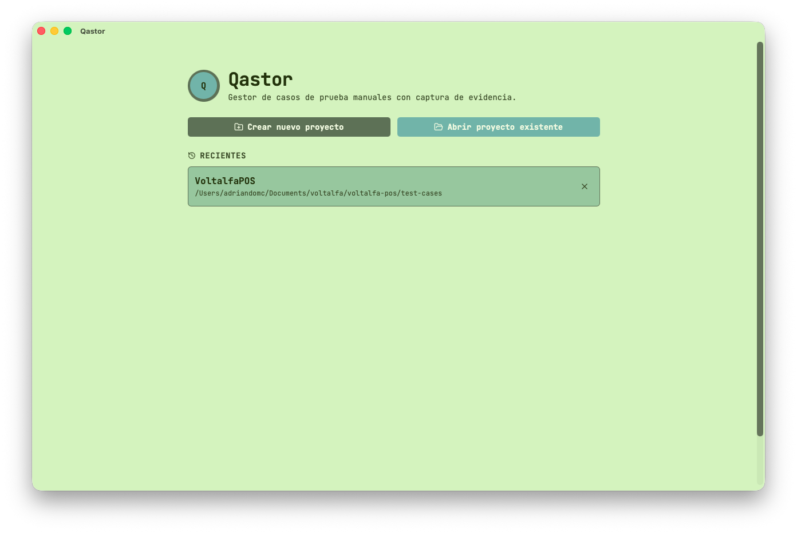
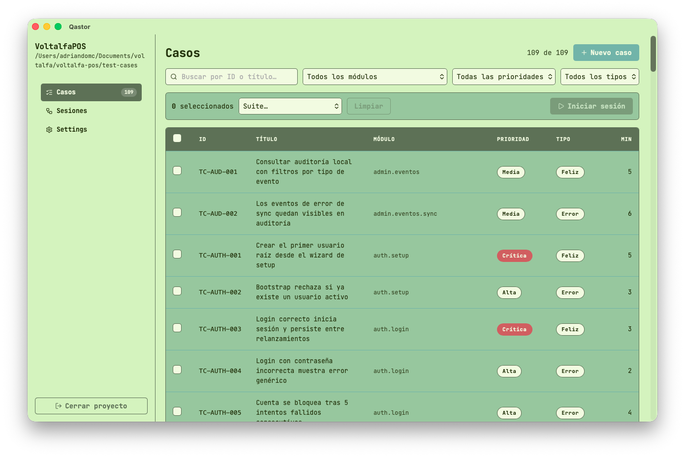
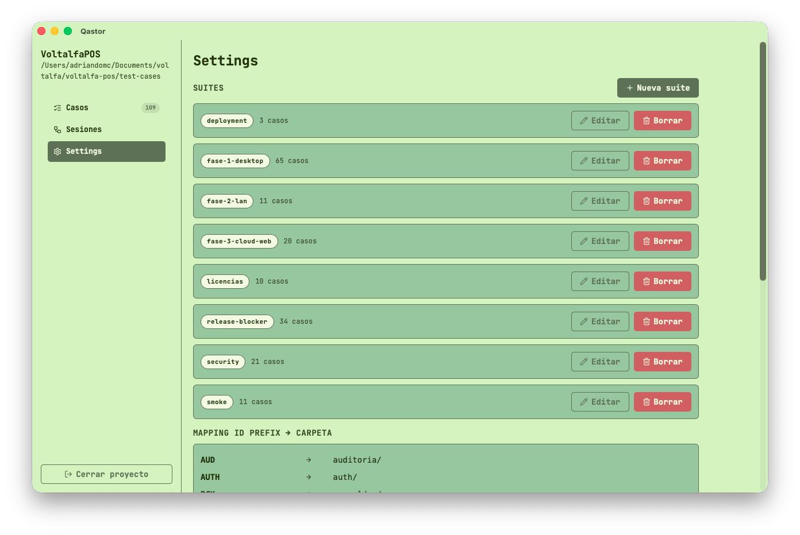
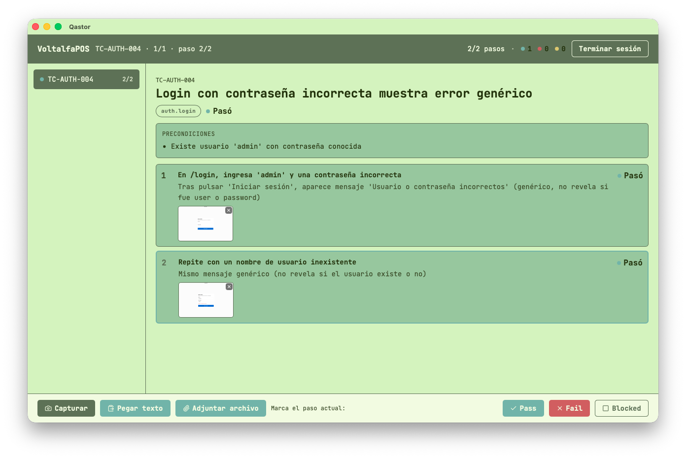

# Qastor: the tool designed to get those troubling manual tests to their rest!

  

## What is this?

Qastor is a multi-platform desktop application that allows you to create manual test cases from an
easy to use interface and gather evidence with just a few clicks/keystrokes, allowing developers to
focus on the actual testing rather than copying-and-pasting screenshots or debug logs.

<table>
  <tr>
    <td>Welcome View</td>
    <td>Cases View</td>
  </tr>
  <tr>
    <td></td>
    <td></td>
  </tr>
  <tr>
    <td>Settings View</td>
    <td>Test Case Detail View</td>
  </tr>
  <tr>
    <td></td>
    <td></td>
  </tr>
</table>

**WARNING: This tool is an early alpha version and hasn't been fully tested in all operating
systems. Proceed with caution.**

## Why does this exist?

The

## Install

There are readily available releases
[here]([https://www.example.com](https://github.com/adriandomc/qastor/releases)) for the major
operating systems (macOS, Windows, Linux), but I recommend you to build it from source, as it is
still in development.
